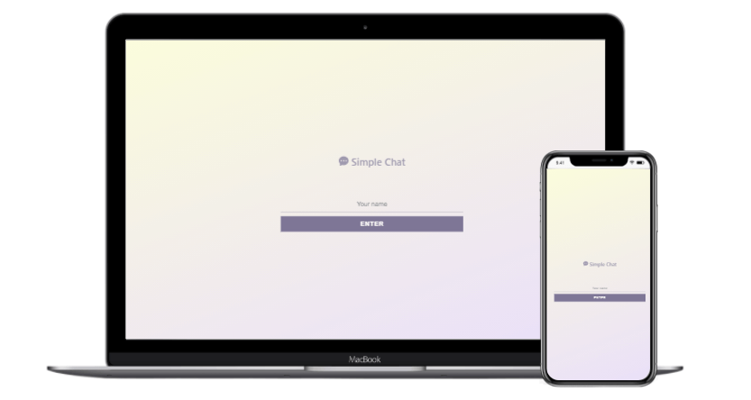

# Simple Chat

This is a simple chat using React.js, Node.js and Socket.io.



You can see it alive [here](https://simple-chat-moons.netlify.app/).

### Features

- Multiple users can join the chat room by entering their names
- Users can type chat messages to the chat room
- A notification is sent to all users when a user joins/leaves the room

### Links

- Website: https://simple-chat-moons.netlify.app/

## Get started

If you want to run this project locally, you can:

1. Clone this project

```bash
git clone https://github.com/iscasur/simple-chat.git
```

2. Go to the project's folder

```bash
cd simple-chat
```

### Backend 💻

3. Go to the server side

```bash
cd server
```

4. Install the dependencies in local

```bash
npm install
```

5. Run development enviroment (server)

```bash
npm run dev
```

### Frontend 🎨

Split your terminal or open a new one.

3. Inside simple-chat folder, go to the client side

```bash
cd client
```

4. Install the dependencies in local

```bash
npm install
```

5. Run the app (client)

```bash
npm run start
```

It will open the app automatically if don't, point your browser to `http://localhost:3000`

## Technologies

| Frontend | Backend    |
| -------- | ---------- |
| React    | Node.js    |
| CSS      | Express.js |
| Netlify  | Socket.io  |
|          | Heroku     |

## Licence

This project is MIT licensed
